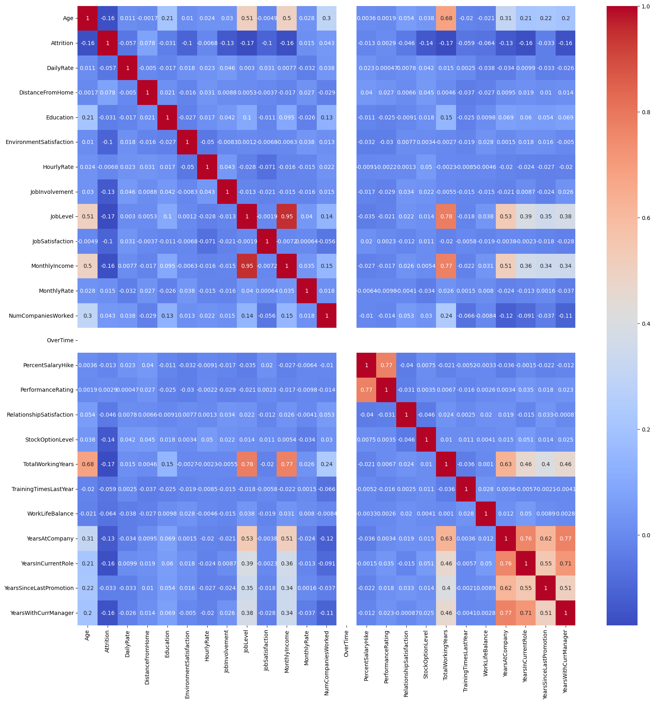
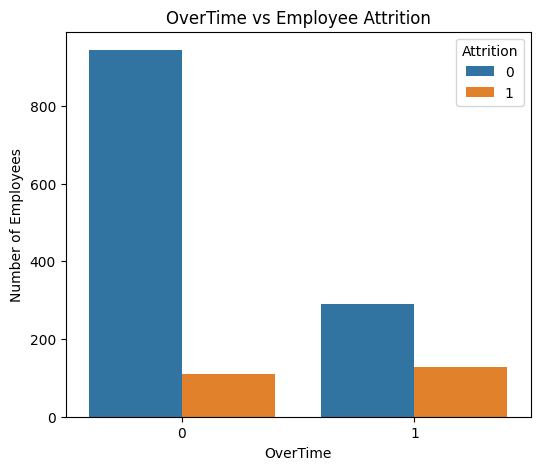
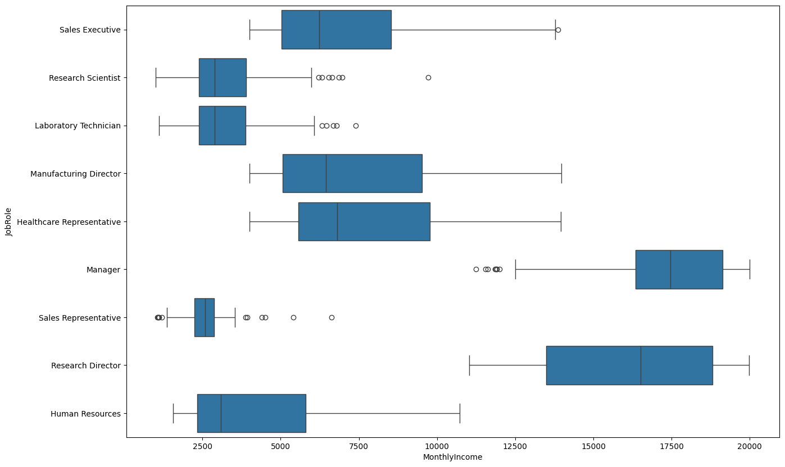

# Employee Attrition Prediction
This project predicts employee attrition by comparing the performance of Linear Regression, Random Forest, &amp; Artificial Neural Network.
----

## 📌 Business Context
Employee hiring and retention are critical challenges for organizations. Recruiting new employees requires significant time, cost, and resources.
According to the project background, companies typically spend 15-20% of an employee's annual salary on recruitment, and it takes an average of 52 days to fill a position.
To reduce turnover-related costs and improve workforce planning, the Human Resources department aims to identify employees who are at risk of leaving the company before they resign.

## 🎯 Project Objective
As a Data Scientist, the objective of this project is to develop a machine learning classification model that predicts employee attrition based on employee-related features.

Three machine learning models—Logistic Regression, Random Forest, and Artificial Neural Networks—are trained and evaluated to determine the most effective model for predicting employee attrition

## 📂 Dataset
The dataset used in this project is the IBM HR Analytics Employee Attrition dataset, which is publicly available on Kaggle.

- **Source:** https://www.kaggle.com/pavansubhasht/ibm-hr-analytics-attrition-dataset
- **Number of Featured :** 35
- **Number of Employees:** 1469
- **Target Variable:** Attrition (Yes/No)
- **Domain:** Human Resources
- **Problem Type:** Binary Classification
  
### Dataset Features

- **Age**
- **MonthlyIncome**
- **JobRole**
- **JobSatisfaction**
- **OverTime**
- **YearsAtCompany**
- **WorkLifeBalance**
- The dataset contains demographic, job-related, compensation, and satisfaction features used to predict employee attrition.

## 🔍 Data Inspection
| Inspection | Result |
|------------|--------|
| Number of Records | 1,470 |
| Number of Features | 35 |
| Missing Values | 0 |
| Duplicate Records | 0 |
| Data Types | Numerical & Categorical |
| Target Variable | Attrition (Yes/No) |

The initial inspection showed that the dataset contained both numerical and categorical features. No missing values or duplicate records were found, indicating that the dataset was generally clean and ready for preprocessing.

## 🧹 Data Cleaning & Processing
Before training the machine learning models, the dataset was preprocessed to ensure all features were in a suitable format for model training.
This included separating the target variable, encoding  categorical features, and feature scaling.

### 1. Separate Features and Target
```python
y = employee_df['Attrition']
X = employee_df.drop('Attrition', axis = 1)
```
The target (Attrition) was separated from the input features before processing.

### 2. Encode Categorical Features
```python
encoder = OneHotEncoder('...')
X_cat_array = encoder.fit_transform(X_cat)
```
Categorical variables were converted into numerical representations using One-HotEncoding.

### 3. Feature Scaling
```python
scaler = StandardScaler()
X_train = scaler.fit_transform(X_train)
X_test = scaler.transform(X_test)
```
Numerical features were standardized using StandardScaler to ensure consistent feature scales and improve model performance.

## 📊 Explore Data Analysis (EDA)
### 1. Attrition Distribution (Countplot)

**Propose :**
To examine the distribution of the target variable (employee attrition).

**Key Insight :**
- The dataset is imbalanced.
- Most employees remained with the company (Attrition = 0).
- Only a smaller proportion of employees left the company (Attrition = 1).

**Why It Matters :**
The class imbalance should be considered during model evaluation. Metrics such as Precision, Recall, and F1-score provide more informative performance assessment than Accuracy alone.

### 2. Correlation Heatmap

**Propose :**
To identify relationships between numerical features and understand potential correlations before model development.

**Key Insight :**
- MonthlyIncome and JobLevels have a very strong positive correlation (0.95), indicating that employees in higher job levels generally earn higher salaries.
- JobLevel and TotalWorkingYears are also strongly correlated (0.78), indicating that employees often progress to higher job levels as they gain more experience.
- Age has a weak negative correlation with Attrition (-0.16), suggesting that older employees are slightly less likely to leave the company.

**Why It Matters :**
Understanding these relationships helps identify important patterns in the data before building a machine learning model.


### 3. Overtime vs Attrition Distribution (Countplot)

**Propose :**
To examine the relationship between overtime work and employee attrition.

**Key Insights :**
- Most employees do not work overtime (OverTime = 0).
- Employees who work overtime (OverTime = 1) show a noticeably higher proportion of attrition than those who do not.
This suggests that overtime is associated with a higher likelihood of employee turnover.

**Why It Matters :**
Overtime may reflect increased workload or reduced work-life balance, making it an important feature for predicting employee attrition.


### 4. Monthly Income by Job Role (Boxplot)


**Propose :**
To compare the monthly income distribution across different job roles and identify salary variation within the organization. 

**Key Insights :**
- Managers have the highest median monthly income among all job roles.
- Research Directors also receive high salaries but exhibit a wider income distribution, indicating greater variability in monthly income.
- Sales Representatives, Laboratory Technicians, and Human Resources employees generally have lower monthly income compared with managerial positions.

**Why It Matters :**
Salary distribution differs substantially across job roles, suggesting that job position is an important characteristic of the workforce and may contribute to employee behaviour. This information provides useful context before building predictive models.


...
